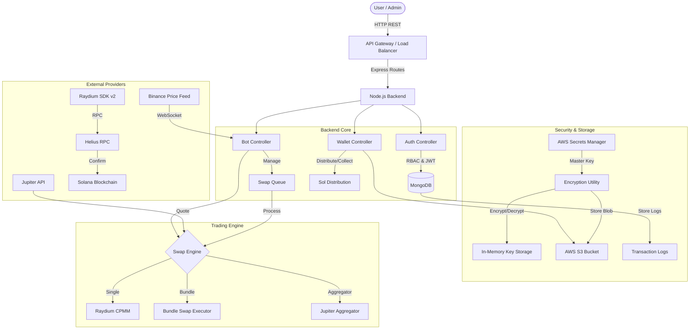
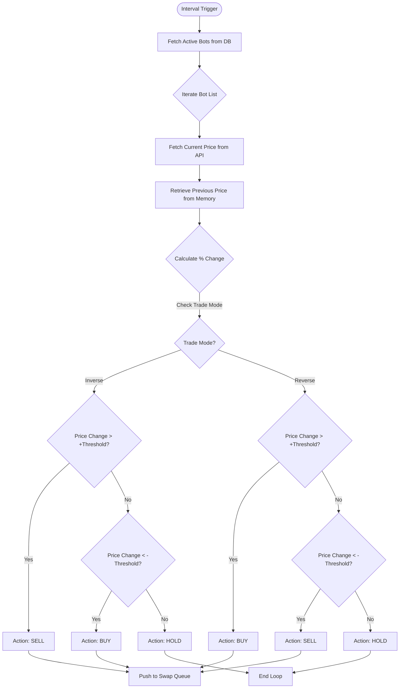
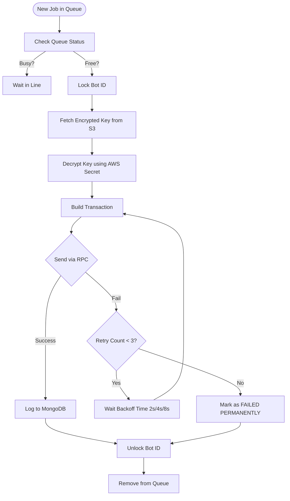

# 📘 Solana Trading Bot - Complete Technical Documentation & Architect's Guide

## 1️⃣ Project Overview & Type Analysis

### **Analyzed Project Type: State-of-the-Art Backend Trading System**

- **Architecture**: Modular Monolithic Backend (Node.js/Express).
- **Domain**: High-Frequency Trading (HFT) & Market Making on Solana.
- **Core Capability**: Automated trading on Raydium (CPMM & CLMM), Wallet Management, and Security.
- **Connectivity**:
  - **Blockchain**: Solana Mainnet (RPC via Helius).
  - **DeFi**: Raydium SDK v2, Jupiter Aggregator.
  - **Cloud**: AWS (S3 for storage, Secrets Manager for encryption).

---

## 2️⃣ Architecture Analysis

### **A. High-Level Architecture Diagram**

The system is built as a centralized command center that orchestrates decentralized actions. It acts as an autonomous agent runner with deep integration into cloud security services.



### **B. Design Patterns Used**

1.  **Controller-Service Pattern**: Logic is separated into Controllers (`BotController`, `cpmm`) handling business rules, while Routes (`routes/*.js`) handle HTTP transport.
2.  **Singleton / Global State**: Uses global variables (e.g., `mappedPrices`) for real-time price caching to reduce DB hits.
3.  **Queue-Based Execution**: Implements a `SwapQueue` to serialize transactions per bot, preventing nonce race conditions.
4.  **Factory Pattern**: Dynamically instantiates Swap Engines (`CPMM` vs `CLMM`) based on pool type.
5.  **Zero-Trust Security Model**: Private keys are never stored in plain text anywhere. They are decrypted in-memory only for the millisecond they are needed.

### **C. Scalability Strategy**

- **Vertical**: Determining bot limits per node based on memory (key decryption is RAM intensive).
- **Horizontal**: The system can be containerized (Docker). Since state is in MongoDB/S3, multiple instances can run worker processes.

---

## 3️⃣ Core Business Logic Breakdown

### **⚡ Detailed Logic Workflows**

#### **Workflow 1: Bot Monitor & Signal Decision (`server.js`)**

This process runs every 60 seconds.



#### **Workflow 2: Swap Execution & Retry Logic (`BotController.js`)**

This ensures robust execution even during RPC congestion.



### **A. Bot Execution Cycle (The "Heartbeat")**

The bot operates on a **polling interval** (default: 60s) to check market conditions and execute trades.

1.  **Global Loop**: `server.js` triggers `checkBots()` every minute.
2.  **Price Fetching**:
    - Iterates through all **Active Bots** in MongoDB.
    - Fetches real-time price from **Binance** or **DexScreener** for the bot's target symbol.
    - Maintains a memory cache (`mappedPrices`) of `previousPrice` vs `currentPrice`.
3.  **Signal Calculation**:
    - Calculates `priceChange = current - previous`.
    - **Inverse Mode**:
      - If `priceChange > threshold`: **SELL** (Profit taking).
      - If `priceChange < -threshold`: **BUY** (Buying the dip).
    - **Reverse Mode**:
      - If `priceChange > threshold`: **BUY** (Momentum follow).
      - If `priceChange < -threshold`: **SELL** (Stop loss).
4.  **Queue Injection**:
    - If a signal generates a trade, a job is pushed to the `SwapQueue`.
    - **Locking**: The bot ID is locked to prevent overlapping swaps.

### **B. Swap Queue System (`BotController.js`)**

To prevent network congestion and nonce errors, swaps are managed via a queue.

1.  **Enqueue**: Swaps are added with status `pending`.
2.  **Processing**:
    - The queue processes items sequentially.
    - **Rate Limiting**: Adds a 2-second delay between swaps.
3.  **Retry Mechanism**:
    - If a swap fails (e.g., RPC timeout), it enters a **Retry Loop**.
    - **Backoff**: Waits 2s, then 4s, then 8s (Exponential Backoff).
    - **Max Retries**: 3 attempts before marking as `failed_permanently`.

### **C. Trading Logic & Execution**

#### **1. Single Swap Execution (`cpmm.js`)**

Handles standard Raydium CPMM swaps.

1.  **Wallet Retrieval**: Fetches encrypted private key from AWS S3, decrypts using AWS Secrets Manager key.
2.  **Pool Calculation**: Fetches Pool Info (`fetchPoolById`), determines inputs/outputs, calculates **Minimum Output** based on Slippage.
3.  **Transaction Builder**: Constructs `makeSwapCpmmBaseInInstruction` using Raydium SDK, adds Compute Budget (Priority Fees).
4.  **Execution**: Sends via Helius RPC, waits for `confirmed` commitment, logs transaction details to `SwappedData`.

#### **2. Bundle Swap Execution (`bundleswapcpmm.js`)**

Advanced logic for high-frequency trading or creating volume.

1.  **Logic**: Executes **multiple Buys and Sells** in a single atomic transaction.
2.  **Instruction Batching**:
    - Loop `buyCount`: Generate Buy Instructions.
    - Loop `sellCount`: Generate Sell Instructions.
    - **Pack**: Adds all instructions to one `Transaction`.
3.  **Efficiency**: Uses `ComputeBudgetProgram` to set higher execution limits (1M units), guaranteeing atomic execution.

#### **3. Jupiter Aggregator Integration (`walletSoltoPair 3.js`)**

Used for wallet rebalancing and maintenance.

1.  **Quote Fetching**: Query Jupiter API for the best route (e.g., Orca, Raydium, Meteora).
2.  **Swap Execution**: Deserialize Jupiter transaction, sign with managed wallet, execute via RPC.
3.  **Use Case**: Converting accumulated dust tokens back to SOL or distributing SOL to sub-wallets.

---

## 4️⃣ Database Structure Deep Analysis (MongoDB)

### **1. `SwapModel` (Active Bots)**

- **Purpose**: Stores configuration for running bots.
- **Key Fields**:
  - `poolId` (String): Target Raydium Pair.
  - `walletAddress` (String): Public key of the trading wallet.
  - `privateKey` (String): **Placeholder** (Stored in S3).
  - `tradeMode`: Enum `inverse` | `reverse`.
  - `thresholdPrice`: % Movement to trigger trade.
- **Indexing**: `walletAddress` (Unique), `poolId`.

### **2. `SwappedData` (Audit Log)**

- **Purpose**: Immutable record of all executed trades.
- **Key Fields**:
  - `transactionId` (String): Solana Signature.
  - `amountIn` / `amountOut`: Exact token amounts.
  - `status`: `success` | `failed`.
  - `ownerInfo`: Snapshot of wallet balance at time of trade.

### **3. `User` (RBAC)**

- **Purpose**: Authentication & Permissions.
- **Key Fields**:
  - `secret`: 2FA Secret (for Superadmin).
  - `permissions`: Reference to `PermissionModel` (for Subadmins).

### **4. `MainWalletModel`**

- **Purpose**: Tracks master funding wallets.
- **Reasoning**: Used to distribute SOL to bot wallets (`distributeSolToPairs`).

---

## 5️⃣ Security & Performance Strategy

### **Security**

1.  **Encryption**: All private keys are AES-256 encrypted using `crypto-js` before leaving the server memory.
2.  **S3 Storage**: Encrypted blobs stored in S3. Even if S3 is compromised, keys are useless without the AWS Secrets Manager password.
3.  **Role Segregation**:
    - `authMiddleware.js` explicitly checks `req.user.role`.
    - Subadmins cannot delete logs or access master keys.
4.  **2FA**: Mandatory for Superadmin operations.

### **Performance**

1.  **Priority Fees**: Dynamic calculation (`ComputeBudgetProgram.setComputeUnitPrice`) prevents stuck transactions during congestion.
2.  **Connection Pooling**: Mongoose uses a shared connection pool.
3.  **RPC Optimization**: Uses Helius RPC for faster transaction propagation.

---

## 6️⃣ Setup & Deployment Guide

### **Prerequisites**

- Node.js v18+
- MongoDB (Atlas or Local)
- AWS Account (S3 + Secrets Manager Access)
- Helius RPC Key

### **Installation**

1.  Clone Repository:
    ```bash
    git clone <repo-url>
    cd MM-BACK
    npm install
    ```
2.  Configure `.env`:
    ```env
    PORT=3005
    MONGODB_URI=mongodb+srv://...
    JWT_SECRET=your_jwt_secret
    AWS_ACCESS_KEY_ID=...
    AWS_SECRET_ACCESS_KEY=...
    AWS_BUCKET_NAME=dex-mm-wallet-store-prod
    HELIUS_KEY=...
    ```

### **Running**

- **Development**: `npm start` (Runs via `nodemon`).
- **Production**: Use PM2.
  ```bash
  pm2 start server.js --name "solana-bot"
  ```

---

## 7️⃣ Future Scalability Suggestions

1.  **Redis Caching**: Replace the in-memory `mappedPrices` variable with Redis to allow multiple server instances.
2.  **WebSockets for Frontend**: Implement `socket.io` to push price updates to the UI instead of polling.
3.  **Rust Integration**: Evaluate moving the heavy math (Tick Array calculations) to a Rust binary or JIT module for microsecond improvements.
