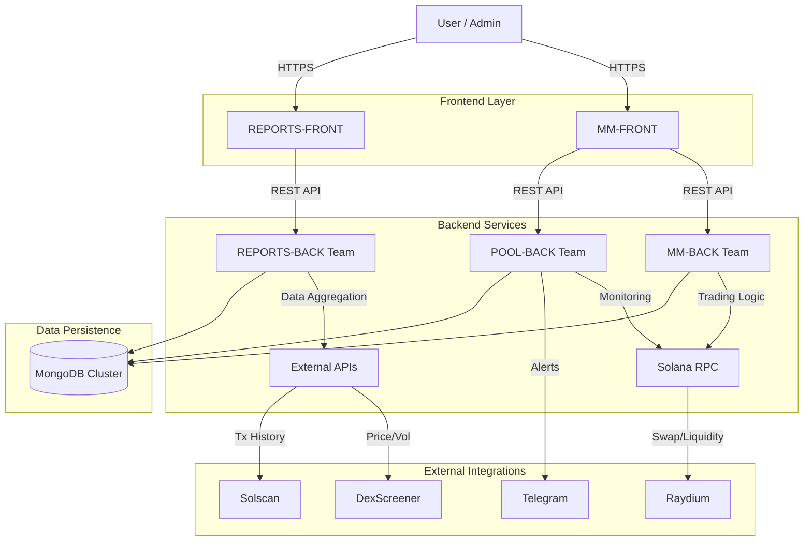
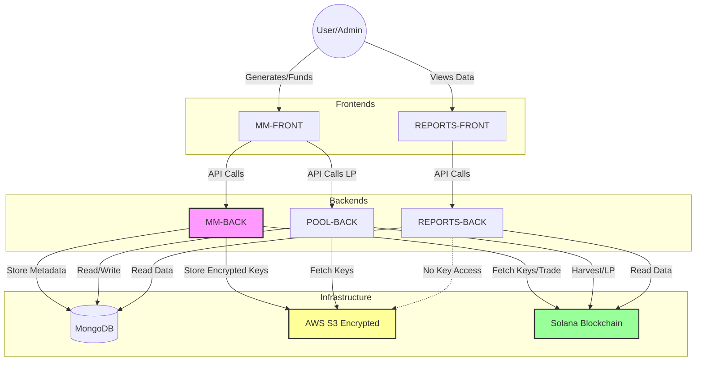

# DEX System Architecture & Technical Audit

## 1. System Architecture Overview

The platform implements a sophisticated, microservices-based automated trading and liquidity management system on the Solana blockchain. Queries are distributed across specialized services to separate trading execution, pool monitoring, and reporting analytics.

### High-Level Service Map

### Execution Lifecycle (Request Flow)

1.  **Client Request**: Initiated from `MM-FRONT` (e.g., "Create Bot").
2.  **API Gateway**: `MM-BACK` Express server receives request on `/api/*`.
3.  **Controller Layer**: Validates input using `express-validator` or custom logic.
4.  **Service Layer**:
    - Fetches wallet keys (decrypted via AWS Secrets Manager/S3).
    - Consults `Raydium SDK` for pool state.
    - Simulates transaction computation.
5.  **Execution**: Signs transaction with `Keypair` and sends to Solana network via Helius RPC.
6.  **Persistence**: On success (`txId` confirmation), transaction details are saved to MongoDB (`SwapModel`, `SwappedData`).
7.  **Response**: JSON payload returned to client.

---

## 2. Frontend Deep Architecture (`MM-FRONT`)

### Architectural Patterns

- **React + Vite**: Uses a modern, fast-build toolchain.
- **Context API for State**: `AuthContext.jsx` manages global user session and JWT handling, avoiding Redux boilerplate for this specific scope.
- **Provider Pattern**: Wraps app in `WalletContext` (Solana adapters) and `AuthProvider`.
- **Protected Routing**: HOC pattern (`ProtectedRoute`, `PublicRoute`) guards routes based on authentication and role (Admin/User).

### Key Components

- **Wallet Integration**: Uses `@solana/wallet-adapter-react` to connect Phantom/Solflare. This is crucial for _signing_ transactions on the client side (if implemented) or just wallet verification.
- **API Access**: `services/api.js` acts as a Singleton Axios wrapper with interceptors for:
  - Automatically attaching `Bearer` tokens.
  - Global error handling (auto-logout on 401).

### Authentication Lifecycle

1.  **Login**: User submits credentials -> `authRoutes/login` -> Returns JWT.
2.  **Storage**: JWT stored in `localStorage` (Persistent).
3.  **Session**: Validated on every route change via `AuthContext`.
4.  **Expiry**: Token expiration triggers interceptor -> Clear Storage -> Redirect Login.

---

## 3. Backend Deep Architecture (`MM-BACK`, `POOL-BACK`)

### Design Pattern: Layered Architecture (Controller-Service-Model)

- **Controllers**: Handle HTTP `req/res`, parsing, and status codes.
- **Services (Implicit)**: Business logic often resides directly in controllers (e.g., `controller/cpmm.js`), which functions as a service layer for Raydium interactions.
- **Models**: Mongoose schemas define strict data structure.

### MM-BACK (Market Maker)

- **Core Responsibility**: Executing automated swaps (Market Making).
- **Automation**: `setInterval` in `server.js` triggers `checkBots()`.
- **Logic**:
  - **Price Check**: Fetches price from Binance/DexScreener.
  - **Threshold Match**: Compares `currentPrice` vs `previousPrice`.
  - **Strategy**: Executes `inverse` (Buy Low/Sell High) or `reverse` (Momentum) strategies.
  - **Concurrency Control**: valid `swapLocks` map prevents double-execution for the same bot.

### POOL-BACK (Pool Management)

- **Core Responsibility**: Monitoring Liquidity Channels (CLMM).
- **Automation**: Polls every 60s (`PoolController.checkAndAlert`).
- **Logic**:
  - **Range Check**: Compares current `tick` vs position `lower/upper` bounds.
  - **Alerting**: Sends Telegram messages on "Out of Range".
  - **Auto-Action**: Triggers `harvest` and `reback` (rebalance) transactions automatically when ranges are breached.

### Security Implementation

- **Secret Management**:
  - **AWS Secrets Manager**: Stores encryption keys `getEncryptionKeyFromSecretsManager`.
  - **AWS S3**: Stores _encrypted_ wallet files.
- **Runtime Decryption**: Private keys are decrypted _only_ in memory during execution and never logged (sanitized in logs).
- **Environment**: strict `.env` usage for RPC URLs and API Keys.

---

## 4. Database Engineering (MongoDB)

### Schema Design & Scalability

- **Document-Oriented**: Suitable for storing variable-structure blockchain data (transaction receipts, pool info).
- **Collections**:
  - `users`: Auth & Roles.
  - `swapmodels`: Bot configurations (Target Pool, Mint A/B, Strategy).
  - `swappeddatas`: Immutable ledger of executed trades (Audit trail).
  - `wallets`: Managed wallet private keys (Encrypted references) and metadata.
  - `rebackmodels`: Tracking rebalancing events for CLMM pools.

### Data Consistency

- **Transactional Integrity**: Logic often checks on-chain confirmation (`connection.confirmTransaction`) _before_ writing to DB. This ensures DB reflects on-chain reality (Event Sourcing pattern).
- **Optimistic Locking**: Not explicitly used, but `swapLocks` in memory serve as a mutex for bot operations.

---

## 5. Blockchain & External API Integration

### Integration Strategy

The system handles high-frequency data from multiple sources:

| Source                  | Type     | Usage                                                 | rate_limit Handling                            |
| :---------------------- | :------- | :---------------------------------------------------- | :--------------------------------------------- |
| **Solana RPC (Helius)** | JSON-RPC | Transaction submission, Account info, Blockhash       | High-throughput paid tier assumed              |
| **Raydium SDK**         | Library  | Swap instruction construction, Pool state parsing     | Client-side computation (Off-chain)            |
| **DexScreener**         | REST API | Real-time price feeds (`/latest/dex/pairs/...`)       | Caching not explicit; reliance on direct fetch |
| **Solscan**             | REST API | Historical transaction analysis (`/account/transfer`) | Pagination implementation (`page`, `limit`)    |
| **Binance**             | REST API | Benchmark price fetching for arbitrage logic          | Standard public limits                         |

### Trading Engines

#### 1. CPMM Engine (`controller/cpmm.js`)

- **Protocol**: Standard AMM (x \* y = k).
- **Flow**:
  1. `fetchPoolById`: Get reserves.
  2. `CurveCalculator.swapBaseInput`: Off-chain simulation to calculate specific output.
  3. `balance.lt(input)`: Pre-flight balance check.
  4. `raydium.cpmm.swap`: Compile instructions.

#### 2. CLMM Engine (`controller/manualSwap.js`, `PoolController.js`)

- **Protocol**: Concentrated Liquidity.
- **Flow**:
  1. Fetch `tickArrayCache`: Mandatory for traversing liquidity bins.
  2. `PoolUtils.computeAmountOutFormat`: Complex calculation considering tick crossings.
  3. **Rebalancing**: If price moves out of tick range, the system closes position (withdraw), swaps tokens to ratio, and opens new position (deposit) centered on current price.

---

## 6. Calculation & Financial Logic

### Precision Handling

- **BN.js / BigNumber**: ALL token amounts are handled as Big Numbers to prevent floating-point errors.
- **Decimal Normalization**:
  - Inputs: Human readable (e.g., "1.5 SOL").
  - Internal: Converted to Lamports/Raw units (`amount * 10^decimals`).
  - Outputs: Converted back for DB storage.

### Profit & Strategy Logic

- **Inverse Mode**:
  - $\Delta Price \ge Threshold \rightarrow Sell$
  - $\Delta Price \le -Threshold \rightarrow Buy$
- **Reverse Mode**:
  - $\Delta Price \ge Threshold \rightarrow Buy$ (Momentum)
  - $\Delta Price \le -Threshold \rightarrow Sell$ (Panic/Stop-loss)
- **Slippage Protection**: Hardcoded or configurable user setting (e.g., 1%). Passed to SDK to generate `minAmountOut`. Transaction fails on-chain if slippage is exceeded.

---

## 7. Security Model

1.  **Wallet Security**:
    - **Non-Custodial Logic**: App acts as a signer using stored keys.
    - **Encryption**: Keys are AES-encrypted before storage.
2.  **Access Control**:
    - `authRoutes`: JWT protection for API endpoints.
    - `adminOnly` middleware: Restricts bot configuration to authorized personnel.
3.  **Input Validation**:
    - Frontend: Type checking and required field validation.
    - Backend: Mongoose casting ensures data types (e.g., Numbers are numbers).
4.  **Infrastructure**:
    - `cors`: configured to allow specific origins (or `*` in dev).
    - `trust proxy`: Enabled for correct IP logging behind load balancers.

---

## 8. Scalability & Production Considerations

- **Statefulness**: The backend services are largely _stateless_ (except for in-memory `botPrices` and `swapLocks`). This allows for horizontal scaling if sticky sessions or a Redis store replaces the in-memory maps.
- **Bottlenecks**:
  - **RPC Limits**: Heavy polling (`setInterval` every 60s * N bots) will hit RPC rate limits. *Recommendation: Switch to WebSocket subscriptions for account updates.\*
  - **Database**: MongoDB handles high read/write well, but historical report generation (`REPORTS-BACK`) aggregation pipelines can represent a heavy load.
- **Failover**:
  - Error handling in `checkBots` ensures one failing bot doesn't crash the loop.
  - `pm2` or `nodemon` ensures process restarts.

---

## 9. Wallet Lifecycle & Architecture Flow

This section outlines the complete lifecycle of wallets within the Dex Market Maker (MM) system, from generation to trading and eventual recycling.

### 9.1. Wallet Generation

**Goal:** Create new wallet addresses for a specific pool and token, securing their keys immediately.

- **Trigger:** API Call `POST /api/generate-pool-wallets`
- **Controller:** `mainController.js` -> `generatePoolWallets`
- **Process:**
  1.  **Validation**: Verifies Main Wallet (M-Wallet), Token, and Pool exist.
  2.  **Key Generation**: Generates new Solana Keypairs.
  3.  **Encryption**: Encrypts private keys using a password fetched from AWS Secrets Manager.
  4.  **Storage (S3)**: Uploads the _encrypted_ private keys to AWS S3. Keys are **never** stored in the database.
  5.  **Storage (DB)**: Creates a record in `poolWalletSchema` with **`status: 0`** (Inactive/Created).
  6.  **Output**: Returns the list of generated Wallet IDs (e.g., `M1-T1-P1-W1`).

### 9.2. Activation & Funding

**Goal:** Fund the wallets with SOL and mark them as ready for use.

- **Step A: Manual Funding**
  - **Action**: Admin/User manually transfers SOL (SOL native) to the generated wallet addresses.
  - _Note: There is no automated "fund from master" script in this stage; it relies on external funding._

- **Step B: Activation**
  - **Trigger:** API Call `PUT /api/update-wallet-status`
  - **Controller:** `mainController.js` -> `updateWalletStatus`
  - **Action**: Updates the wallet status in the database from `0` to **`1`** (Ready).

### 9.3. Bot Assignment (Portfolio Balancing)

**Goal:** Convert the raw SOL in the wallet into the required trading pair (Token A + Token B or wSOL) and assign a bot.

- **Trigger:** API Call `POST /api/create-swap-bot`
- **Controller:** `BotController.js` -> `createSwapBot`
- **Prerequisites**: Wallet must have **`status: 1`**.
- **Process:**
  1.  **Validation**: Checks wallet status and sufficient SOL balance (> 0.01 SOL).
  2.  **Distribution (`distributeSolToOnePair`)**:
      - BotController calls `WalletSoltoPairController.distributeSolToOnePair`.
      - Retrieves private key from S3 (decrypted temporarily).
      - **Splits SOL**:
        - Retains ~10% SOL for gas.
        - Uses 90% of SOL: Splits 50/50.
        - **For Standard Pairs**: Swaps 50% of tradeable SOL for the Token.
        - **For Bundle/CPMM**: May swap 50% for Token and wrap 50% to wSOL.
  3.  **Bot Creation**: Creates a `SwapModel` record (The Bot).
  4.  **Status Update**: Updates wallet status to **`2`** (Active/Trading).

### 9.4. Trading Activities

**Goal:** Execute Market Making strategies.

- **Controller:** `BotController.js` & `bundleswapcpmm.js`
- **Process**:
  - Bots poll for opportunities or execute commands based on `SwapModel` config.
  - **Encryption**: For every transaction, the private key is fetched from S3 and decrypted on-the-fly.
  - **Swaps**: Executes swaps on Raydium (CPMM/CLMM).

### 9.5. Rebalancing (Maintenance)

**Goal:** Adjust portfolio ratios if they drift too far.

- **Trigger:** Manual/Scheduled Script `rebalanceWalletsScript`
- **Controller:** `walletSoltoPair 3.js`
- **Process**:
  - Checks balances.
  - Swaps tokens back to SOL or vice-versa to maintain target ratios.

### 9.6. Closure & Recycling

**Goal:** Stop trading, reclaim funds, and decommission the wallet.

- **Trigger:** API Call/Process `processExpiredBotsQueue` (or similar cleanup routine).
- **Controller:** `mainController.js`
- **Process**:
  1.  **Stop Bot**: Sets Bot status to stopped.
  2.  **Consolidate Funds**:
      - Swaps all Tokens back to SOL.
      - Unwraps wSOL to SOL.
  3.  **Sweep**: Transfers all SOL (minus gas) from the Sub-Wallet to the **Main Wallet** (M-Wallet).
  4.  **Decommission**: Updates wallet status back to `0` (or deletes/archives).

### 9.7. Summary of Status Codes

| Status | Meaning     | Next Step                  |
| :----- | :---------- | :------------------------- |
| **0**  | **Created** | Waiting for Funding        |
| **1**  | **Ready**   | Waiting for Bot Assignment |
| **2**  | **Active**  | Currently Trading          |

### 9.8. Application Architecture & Wallet Relations

This section details how each application component interacts with the wallets throughout their lifecycle.

#### Component Roles

1.  **MM-FRONT (Market Maker Frontend)**
    - **Role**: The primary control panel for the User/Admin.
    - **Wallet Interactions**:
      - Triggers **Generation** (calls `MM-BACK`).
      - Triggers **Activation** (calls `MM-BACK`).
      - Triggers **Bot Creation** (calls `MM-BACK`).
      - Manages **Liquidity Wallets** (calls `POOL-BACK`).

2.  **MM-BACK (Market Maker Backend)**
    - **Role**: The core execution engine for trading bots.
    - **Wallet Interactions**:
      - **Generates** keys and stores encrypted versions in S3.
      - **Activates** wallets in the database.
      - **Executes Swaps** (Trading) using the private keys (decrypted on-the-fly).
      - **Splits Funds** (SOL -> Token/wSOL) for portfolio balancing.

3.  **POOL-BACK (Liquidity Pool Backend)**
    - **Role**: Manages default liquidity positions and administrative wallet functions.
    - **Wallet Interactions**:
      - **Adds/Updates** "Company" or "Pool" wallets (LP Providers).
      - **Harvests Fees** from CLMM positions.
      - **Rebalances** LP positions (Reback).
      - _Note: Shares the same S3 bucket and encryption key mechanism as MM-BACK._

4.  **REPORTS-BACK (Analytics Backend)**
    - **Role**: Read-only data aggregation and performance tracking.
    - **Wallet Interactions**:
      - **Reads** wallet balances and transaction history.
      - **Calculates PnL** (Profit & Loss).
      - **Does NOT** execute trades or manage private keys.

5.  **REPORTS-FRONT (Analytics Frontend)**
    - **Role**: Visualization dashboard.
    - **Interaction**: Consumes APIs from `REPORTS-BACK` to display wallet performance graphs.

#### Architecture Diagram

_Verified by System Audit - 2026_
